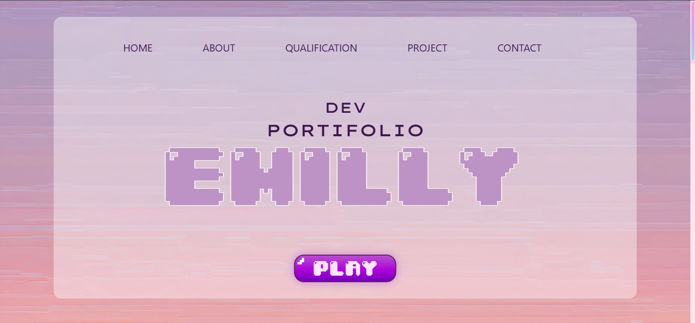

Este é o meu portfólio pessoal desenvolvido com HTML, CSS e JavaScript, publicado via **GitHub Pages**.  
Aqui apresento meus projetos, habilidades, trajetória e informações para contato profissional.

## 🚀 Acesso ao site

👉 [Clique aqui para acessar o portfólio](https://emilly12321.github.io)

## 📌 Tecnologias utilizadas

- HTML5
- CSS3
- JavaScript
- Boostrap
- Git e GitHub
- GitHub Pages (deploy)

## 🖥️ Estrutura do projeto

- `index.html` – Página principal com navegação seções como Home, Sobre, Habilidades e Contato.
- `assets/css/` – Arquivos de estilo customizado.
- `assets/js/main.js` – Lógica de interação, como scroll suave e botão “voltar ao topo”.
- `assets/img/` – Imagens utilizadas no layout.
- `assets/icons/` – Ícones utilizadas no layout.
- `assets/fonts/` – Fontes utilizadas no layout.

## ✨ Funcionalidades

- Design responsivo
- Menu com rolagem suave
- Botão “voltar ao topo”
- Seções separadas com conteúdo organizado
- Link para redes sociais

## 📷 Preview



## 📁 Como clonar e rodar localmente

```bash
git clone https://github.com/emilly12321/emilly12321.github.io.git
cd emilly12321.github.io
# abra o index.html no seu navegador
